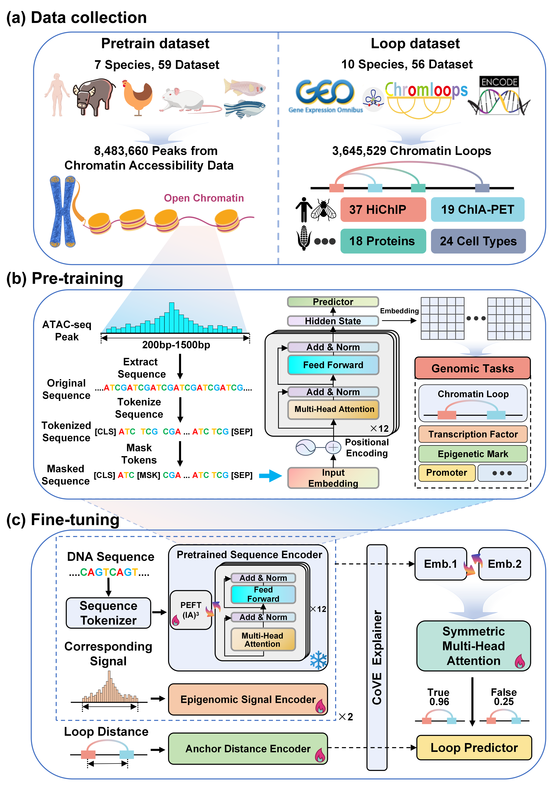

<div align="center">

# 🧬 CLAMP
### Chromatin Loop prediction via Accessibility Model for Protein-mediated loops


<p align="center">
  
  
  
  
  
</p>


</div>

<!-- ---

## 📋 Table of Contents
- [🧬 CLAMP](#-clamp)
    - [Chromatin Loop prediction via Accessibility Model for Protein-mediated loops](#chromatin-loop-prediction-via-accessibility-model-for-protein-mediated-loops)
  - [📋 Table of Contents](#-table-of-contents)
  - [📋 Overview](#-overview)
    - [Key Features:](#key-features)
  - [📥 Installation](#-installation)
    - [System Requirements](#system-requirements)
    - [Setup Environment](#setup-environment)
  - [🚀 Quick Start](#-quick-start)
    - [Data Preparation](#data-preparation)
      - [Download Example Data](#download-example-data)
    - [Inference](#inference)
    - [Embedding Extraction](#embedding-extraction)
    - [Fine-tuning](#fine-tuning)
  - [❓ FAQ](#-faq)
    - [General Questions](#general-questions)
    - [Technical Questions](#technical-questions)
  - [🤝 Contributing](#-contributing)
  - [📜 License](#-license)

--- -->

## 📋 Overview

CLAMP (Chromatin Loop prediction via Accessibility Model for Protein-mediated loops) is a 
framework built upon a language model pre-trained on extensive, cross-species chromatin 
accessibility data. Our model understands the "grammar" of the genome by analyzing DNA sequences 
and their relationship with 3D chromatin structure.

<div align="center">

<p><i>Workflow diagram of CLAMP framework</i></p>
</div>

### Key Features:
- 🔍 Predicts chromatin loops by integrating deep DNA sequence features
- 🧪 Utilizes local epigenetic signals at loop anchors
- 📏 Incorporates genomic distance between anchors
- 🔄 Foundation model architecture provides biological sequence representations 
- 🧠 Applicable to a broad range of genomic tasks
- 🌍 Pre-trained on multiple species (human, mouse, chiken, etc.)
- 🔧 Fine-tunable on specific loop-mediated proteins (CTCF, RAD21, etc.)

---

## 📰 News

🎉 **Major Update!** We have launched a user-friendly online prediction platform [CLAMP+](https://clamp.sysomics.com)! Now you can easily use CLAMP for chromatin loop prediction through a web interface, without local installation and configuration.

<div align="center">
<p>Visit <a href="https://clamp.sysomics.com">https://clamp.sysomics.com</a> to start using it now!</p>
</div>

---

## 📥 Installation

### System Requirements
- Python 3.12.2
- CUDA-capable GPU (recommended) or CPU
- 16+ GB RAM (recommended)
- Storage: ~1GB for models and ~50GB for reference genomes

### Setup Environment

```bash
# Clone repository
git clone https://github.com/chikit2077/CLAMP-paper.git
cd CLAMP-paper

# Create and activate conda environment
conda create -n clamp python=3.12.2
conda activate clamp

# Install dependencies
conda install -c conda-forge -c bioconda conda-forge::transformers=4.46.2 \
    pyfaidx=0.8.1.3 peft=0.13.2 jupyter biopython=1.84 pandas=2.2.2 \
    scikit-learn=1.5.2 accelerate=1.1.1 matplotlib-base=3.9.2 \
    seaborn=0.13.2 pybigwig=0.3.22 h5py=3.12.1

# Install PyTorch - GPU version
pip install torch==2.5.1 torchvision==0.20.1 torchaudio==2.5.1 --index-url https://download.pytorch.org/whl/cu118

# OR, install PyTorch - CPU version
# pip install torch==2.5.1 torchvision==0.20.1 torchaudio==2.5.1 --index-url https://download.pytorch.org/whl/cpu

# Verify GPU availability
python -c "import torch; print(f'GPU available: {torch.cuda.is_available()}')"
```

---

## 🚀 Quick Start


### Data Preparation

For model inference, three types of data are required:

| Data Type | Description | Example | Format |
|-----------|-------------|---------|--------|
| Reference Genome | Species-specific genome assembly | Human GRCh38 | FASTA (.fa) |
| Epigenetic Signal | Cell-specific signal (P-values) | ATAC-seq/DNase-seq from A673 cells | bigWig (.bw) |
| Loop Candidates | Genomic regions to evaluate | Anchor pairs with chromosome, start, end | CSV |

The CSV format for loop candidates should have the following columns:
```
chrom1,start1,end1,chrom2,start2,end2
1,888866,893956,1,910459,914430
15,64739955,64744714,15,64808464,64811195
```

#### Download Example Data

```bash
# Download epigenetic data (A673 cell line)
wget -O data/A673.bigWig https://www.encodeproject.org/files/ENCFF107RAU/@@download/ENCFF107RAU.bigWig

# Download reference genome (hg38)
wget -O - https://ftp.ensembl.org/pub/release-113/fasta/homo_sapiens/dna/Homo_sapiens.GRCh38.dna.toplevel.fa.gz | \
    gzip -d > reference/Homo_sapiens.GRCh38.dna.toplevel.fa
```

### Inference

Predict chromatin loops using pre-trained CLAMP models:

```bash
conda activate clamp

# For CPU-only inference
python src/inference/loop_prediction.py \
    --species homo_sapiens \
    --batch_size 5 \
    --seed 42 \
    --test data/test_loop_dataset.csv \
    --bw data/A673.bigWig \
    --reference_genome reference/Homo_sapiens.GRCh38.dna.toplevel.fa \
    --base_model_path chikit2077/CLAMP-6mer-1500bp-pretrain \
    --clamp_model_path chikit2077/CLAMP \
    --result_dir result/loop_prediction_result

# For GPU-accelerated inference (recommended)
accelerate launch --config_file config/1gpu_fp16.yaml src/inference/loop_prediction.py \
    --species homo_sapiens \
    --batch_size 10 \
    --seed 42 \
    --test data/test_loop_dataset.csv \
    --bw data/A673.bigWig \
    --reference_genome reference/Homo_sapiens.GRCh38.dna.toplevel.fa \
    --base_model_path chikit2077/CLAMP-6mer-1500bp-pretrain \
    --clamp_model_path chikit2077/CLAMP \
    --result_dir result/loop_prediction_results
```

**Inference Output:**
- `prediction_results.csv`: Contains loop predictions with confidence scores

### Embedding Extraction

Extract embeddings from the pre-trained model for use in other genomic tasks:

```bash
conda activate clamp

# For CPU-only extraction
python src/inference/embedding_extraction.py \
    --batch_size 5 \
    --seed 42 \
    --fasta data/test_fasta.fasta \
    --base_model_path chikit2077/CLAMP-4mer-500bp-pretrain \
    --result_dir result/embedding_extraction

# For GPU-accelerated extraction (recommended)
accelerate launch --config_file config/1gpu_fp16.yaml src/inference/embedding_extraction.py \
    --batch_size 10 \
    --seed 42 \
    --fasta data/test_fasta.fasta \
    --base_model_path chikit2077/CLAMP-4mer-500bp-pretrain \
    --result_dir result/embedding_extraction
```

**Embedding Output:**
- Attention scores for each DNA sequence (`.csv`)
- PCA dimension reduction results (`.png`)
- NPY format embedding files (Dimension: batch_size × 512 × 768) (`.npy`)

<div align="center">

<p><i>Example: PCA visualization of DNA sequence embeddings</i></p>
</div>

### Fine-tuning

Fine-tune CLAMP on your own chromatin loop dataset:

```bash
conda activate clamp

# Example using CTCF-mediated chromatin loop dataset from human A673 cell line
accelerate launch --config_file config/1gpu_fp16.yaml src/finetune/finetune.py \
    --batch_size 24 \
    --seed 42 \
    --epochs 50 \
    --patience 5 \
    --lr 3e-05 \
    --train data/CTCF/A673/HiChIP/train.csv \
    --val data/CTCF/A673/HiChIP/val.csv \
    --test data/CTCF/A673/HiChIP/test.csv \
    --bw data/A673.bigWig \
    --reference_genome reference/Homo_sapiens.GRCh38.dna.toplevel.fa \
    --tokenizer_path tokenizer/kmer_1500bp/tokenizer-6mer \
    --kmer 6 \
    --pretrained_model chikit2077/CLAMP-6mer-1500bp-pretrain \
    --result_dir result/finetune-homo_sapiens-CTCF-A673-HiChIP
```

**Fine-tuning Output:**
- Fine-tuned model checkpoints
- Training logs and metrics
- Evaluation results on test set


---

## ❓ FAQ

### General Questions

**Q: What makes CLAMP different from other chromatin loop prediction methods?**  
A: CLAMP uniquely integrates sequence-level DNA features with epigenetic signals and uses a pre-trained language model approach that captures the "grammar" of DNA sequence. Unlike other methods that rely solely on sequence or epigenetic data, CLAMP can generalize across cell types and species.

**Q: Can CLAMP work with species other than human?**  
A: Yes, CLAMP is pre-trained on multiple species and can be applied to any species with a reference genome and compatible epigenetic data.

### Technical Questions

**Q: What are the input data requirements?**  
A: You need:
1. A reference genome in FASTA format
2. Epigenetic signal data (ATAC-seq preferred) in bigWig format
3. Candidate loop regions in CSV format

**Q: How long does inference take?**  
A: With 4 NVIDIA A100 GPUs, CLAMP can process approximately 448 loop candidates per second. CPU-only inference is more slower.

**Q: How much memory does CLAMP require?**  
A: The model requires about 3GB of GPU memory for inference and 11GB for fine-tuning. CPU-only mode requires at least 16GB of system RAM.

---

## 🤝 Contributing

We welcome contributions to the CLAMP project! Here's how you can help:

1. **Report bugs or suggest features** by opening an issue
2. **Contribute code** through pull requests
3. **Share your fine-tuned models** for specific cell types or proteins


---

<!-- ## 📝 Citation

If you use CLAMP in your research, please cite our paper:

```bibtex
@article{CLAMP2023,
  title={CLAMP: Chromatin Loop prediction via Accessibility Model for Protein-mediated loops},
  author={Chiki Ho},
  journal={bioRxiv},
  year={2025},
  doi={10.1101/XXXX}
}
```

--- -->

## 📜 License

This project is licensed under the GNU General Public License v3.0 (GPL-3.0) - see the [LICENSE](LICENSE) file for details.

---

<div align="center">
  <p>© 2025 CLAMP Team</p>
  <p>
    <a href="https://github.com/chikit2077/CLAMP-paper">GitHub</a> •
    <a href="https://github.com/chikit2077/CLAMP-paper/issues">Report Bug</a> •
    <a href="https://github.com/chikit2077/CLAMP-paper/issues">Request Feature</a>
  </p>
</div>